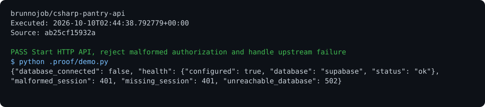

# Pantry API

A household inventory API with expiry dates, locations, audited movements, idempotency, and optimistic revision control.

## Run

Requirements: ASP.NET Core 8 and Supabase.

```sh
dotnet restore
dotnet build
dotnet run
```

## Behavior

Set `SUPABASE_URL` and `SUPABASE_PUBLISHABLE_KEY`. Send `Authorization: Bearer <session>`. Routes: `/health`, `/items`, `/items/{id}/quantity`, `/alerts/expiring`, and `/movements`. Adjustments use the transactional `bd_adjust_pantry` function; each user accesses their own stock.

## Optional report archive

Use the [shared operations archive client](https://github.com/brunnojob/vercel-home-telemetry-api/tree/main/cloud) to queue `result.json` under project `csharp-pantry-api`. The client uses `BRUNNODEV_ACCESS_TOKEN` and retains unacknowledged reports locally.

## License

Original source and documentation are MIT licensed; see [LICENSE](LICENSE). Third-party dependencies and media retain their respective terms. Maintained by [Brunno Dev](https://brunnodev.store).

## Implementation update

Anonymous Supabase accounts receive HTTP 403. Malformed upstream JSON returns HTTP 502. `GET /items?limit=100&offset=0` provides deterministic expiry/id ordering with a maximum page size of 500 and bounded offsets.

Contribution trailer: `Co-authored-by: nyctophile <33561761+ineedfoundmyway@users.noreply.github.com>`.

## Execution proof

[](https://github.com/brunnojob/csharp-pantry-api/actions/workflows/proof.yml)



[Verified run](https://github.com/brunnojob/csharp-pantry-api/actions/runs/38018065864) · [Execution report](docs/proof/evidence.json)

Run `python .proof/record.py` after installing the prerequisites above. The scenarios execute repository code and verify exit codes and expected output. CI publishes `execution-proof` with the transcript, input fingerprints and source commit. The downloadable report identifies the exact tested version; the workflow badge tracks the latest run.
